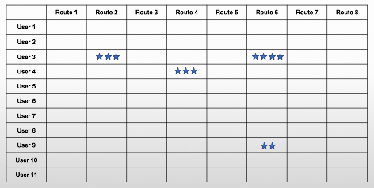
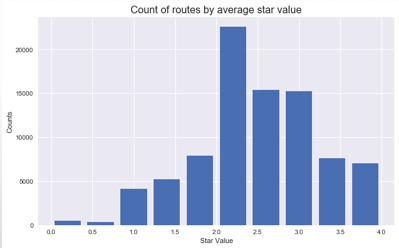
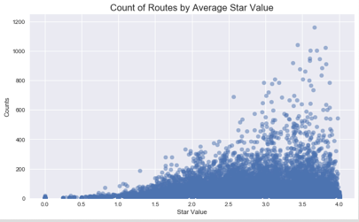
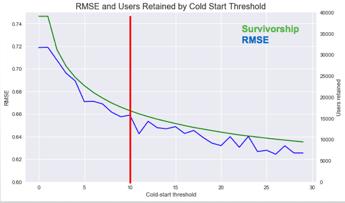
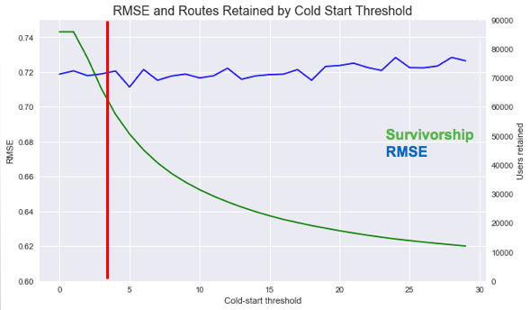
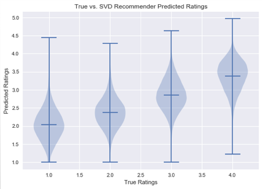

# [Mountain Project](www.MountainProject.com) Recommender

### Background & Objectives

Mountain project is a climbing website with an extensive [route database](https://www.mountainproject.com/route-guide), active discussion [forum](https://www.mountainproject.com/forum), and ~20k active users. Users can browse over 100k climbing routes, **tick** the routes that they have climbed and **rate** them on a 4-star scale. Additionally, users can upload photos and share useful information about their experience on each route in the comments section.

While there is a wealth of climbing info on the website, it can be difficult to discover the routes that you will enjoy the most. Finding the **classic** routes can be like finding a needle in a haystack. Moreover, different climbers have different tastes, and so finding routes that will appeal you specifically can be even more difficult.

My goal with this project was to build a recommender system based on data collected from the website to do just this. The idea was to provide users with **personalized recommendations** which cater to their taste then build this recommender into an app which queries the entire route database based on a handful of user selected filters and then returns the top 10 routes that meet the users filtering criteria.

### Data Collection

The key data I needed for my recommender were the explicit ratings that users gave to each route. Furthermore, I wanted to gather as much data about each route as I could for deeper analyses and filters for the recommender app.

 First, I needed to compile a list of all `routeIDs` - a unique identifier that MountainProject assigns to each route. For a `userID`, I made an API call to MountainProject and get a list of all of the `routeIDs` which that user had **ticked**. Similarly, for each `routeID`, I parsed out all of the `userIDs` that had rated that particular route. In this way, I was able to bounce back and forth and iteratively expand my set of `routeIDs` to include most of database.

- Links to code for the [class structure](https://github.com/sailskisurf23/MtProj/blob/master/1_data_coll/MtProjScraper.py) and [helper functions](https://github.com/sailskisurf23/MtProj/blob/master/1_data_coll/mt_scrape_helpers.py)

- With a list of routeIDs, its relatively straight forward to make an HTML request and get all of the raw HTML associated with each route page. I stored this data in a MongoDB with each route as a **document**; [code](https://github.com/sailskisurf23/MtProj/blob/master/1_data_coll/routepages_to_db.py).

- The Mountain Project API also had some useful data about each route parsed nicely into JSON strings; [code](https://github.com/sailskisurf23/MtProj/blob/master/1_data_coll/routefeatures_to_db.py)

### Data Processing

I needed to clean and standardize my data to make it useful for my recommender and app. For the app, I needed to map several variables (grades, locations etc.) to a simplified scale to match the filters I chose for my app; [code](https://github.com/sailskisurf23/MtProj/blob/master/3_data_processing/routefeatures_cleaning.py)

The key to the recommender was to create the **RUS file** which was a CSV with three columns: `routeID`,`userID`,`star`; [code](https://github.com/sailskisurf23/MtProj/blob/master/3_data_processing/mongo_to_CSV.py). Each row contains the star value on a 4-star scale that each user gave to each route. The data in this file can be represented as a **sparse user-item matrix**. The goal of our recommender is to fill in the missing values in this matrix and thereby *predict* what a user would rate the climbs that she has not climbed.  

### Analysis

#### Matrix Sparsity

The first thing I looked at was the sparsity of our matrix in order to determine the best approach for our recommender system.

<Table of Matrix Stats>

Two most ubiquitous types of recommender systems are *Content-Based* and *Collaborative Filtering*. Content-based recommender systems focus on the *characteristics* of the users or items and give you recommendations based on the *similarity* between them. Model-based collaborative filtering produces recommendations based on the knowledge of users’ attitude to items to recommend items. As it turns out model-based collaborative filtering handles large sparse datasets well and can quickly deliver predictions on-demand which is perfect for this application.

#### Distribution of Ratings

One important thing to consider is the distribution of the ratings. We have a good distribution of ratings, so this will be helpful for picking up on users' preferences.

Routes with the low star ratings don’t tend have many ratings which makes sense (bad routes aren't climbed often, whereas great climbs get climbed a lot). However, this will have some interesting consequences when we start to consider **The Cold Start Problem**

#### The Cold Start Problem

A **cold-start** is a user who hasn't rated many items or an item that hasn't been rated by many users. In these situations, our recommender model doesn't have much to work with when making predictions which negatively impacts the performance of our model. We can resolve this issue by setting a **threshold** and excluding users or items from our model that don't have the requisite number of ratings.

As we might expect, the error for our model improves as we raise the route threshold:

Interestingly however, the model does not improve as we raise the threshold for the number of ratings required for routes to be included in the model. From the scatterplot above recall that many of the low rated routes fall into the region below the threshold. Therefore the model starts to lose useful information about what routes users *don't like*.

I ended up setting the user threshold to a minimum of 10 routes rated to improve performance. I set the route threshold to three since I felt that routes with fewer ratings than that didn't have reliable info and certainly wouldn't be considered *classics* and therefore I didn't want them to slip into any top ten recommendations.

#### Fitting the Model

I used the `suprise` [library](https://surprise.readthedocs.io/en/stable/getting_started.html) to do Singular Value Decomposition and did a bit of grid searching to find the optimal hyperparameters for my dataset. The hyperparameters I focused on were learning rate, regularization rate, and the number of epochs. Due to the size of the dataset, there was a lot of processing power and RAM required to search the grid. I employed several AWS EC2 instances to search different parts of the "grid".

We ended up with a fairly good result with a RMSE of 0.62. We can also see from these violin plots that our predicted ratings trend nicely with the True ratings, especially in the 3/4 star region which is where it counts for our top-10 recommender.

### Web application <link to Web Application>

**Disclaimer, Application is not always running these days as EC2 costs have started to hit my wallet**

The last piece of this project was implementing my recommender into a web [application](http://mp-recommender.netlify.com/). I partnered with a web-developer, [Ian Schummann](https://www.linkedin.com/in/ianschumann/), to build a [front-end](https://github.com/ian-schu/mountain_project_collab). When a user selects items from the drop-downs and hits submit a JSON string is generated and sent to a `Flask` [app](https://github.com/sailskisurf23/MtProj/blob/master/6_app/app_v1.py). The flask app processes this JSON string, filters the route database for the routes that meet the criteria specified, sorts the remaining routes based on the estimated rating and then returns the top 10. The key to this was rolling my recommender model and my filtering variables into a single Python Object which I then pickle and pull into the Flask app. I defined a [class](https://github.com/sailskisurf23/MtProj/blob/master/6_app/json_handler_v1.py) `JSON_handler` to do this.

### Next steps

- Find a web service to run the app indefinitely
- Do more tuning and diagnostics to ensure that the recommendations provided are in line with users’ preferences
- Dive into descriptions the comments section and create filters based on **keywords** determined via Natural Language Processing
